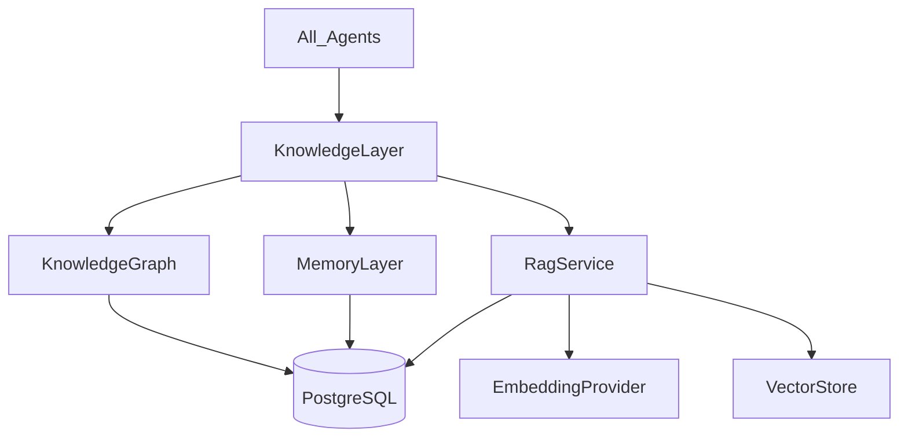

# KNOWLEDGE_LAYER.md

> Central nervous system of AI BASE. Implementation: `packages/knowledge`, `packages/embeddings`, `packages/vector`, plus schema tables in `packages/database`.

## Purpose

AI BASE is not only a content factory. It is a **company that accumulates shared knowledge**. Every agent reads and writes:

1. **Knowledge Graph** — tools, categories, companies, pricing, APIs, use cases, competitors, similarity
2. **Memory Layer** — successes, failures, improvements, observations
3. **RAG** — chunked documents + embeddings + vector retrieval

## Architecture



Agents receive `ctx.knowledge: KnowledgeLayer` from `@ai-base/agents-sdk`.

## Knowledge Graph

Tables: `knowledge_nodes`, `knowledge_edges`

Node types: `tool`, `category`, `company`, `use_case`, `pricing`, `api`, `feature`, `persona`, `competitor_set`, `concept`, `document`, `other`

Edge types: `similar_to`, `competes_with`, `belongs_to`, `made_by`, `used_for`, `has_pricing`, `has_api`, `has_feature`, `alternative_to`, `related_to`, `mentions`, `derived_from`

API: `ctx.knowledge.graph.upsertToolGraph(...)`, `neighbors(...)`, `contextForTool(slug)`

## Memory Layer

Table: `agent_memories`

Kinds: `run_success`, `run_failure`, `improvement`, `observation`, `decision`, `feedback`, `fact`

Scopes: `global`, `agent`, `workflow`, `tool`, `correlation`

SDK auto-records success/failure after each agent run. Agents may also call:

- `ctx.knowledge.memory.recall(...)`
- `ctx.knowledge.memory.recordImprovement(...)`

## RAG

Tables: `knowledge_documents`, `knowledge_chunks` (metadata) + VectorStore payloads

Flow: ingest → chunk → embed → upsert vectors → retrieve by similarity

```ts
await ctx.knowledge.rag.ingestDocument({ title, content, sourceType })
await ctx.knowledge.rag.retrieve(query)
await ctx.knowledge.decisionContext({ agentKey, query, toolSlug })
```

## Embedding providers (Provider pattern)

Package: `@ai-base/embeddings`

| ID | Notes |
|----|-------|
| `openai` | text-embedding-3-* |
| `voyage` | Voyage AI |
| `cohere` | Cohere Embed |
| `jina` | Jina Embeddings |
| `bge` | HF / OpenAI-compatible BGE |
| `ollama` | Local Ollama `/api/embeddings` |
| `mock` | Deterministic offline |

Env: `EMBEDDING_PROVIDER`, `EMBEDDING_MODEL`, vendor keys. Extension: `registerEmbeddingProvider`.

## Vector backends (swappable)

Package: `@ai-base/vector` — `VectorStore` port

| ID | Notes |
|----|-------|
| `postgres` | Default durable JSON embeddings in `vector_records` |
| `pgvector` | Alias ready for native pgvector |
| `memory` | In-process (tests) |
| `qdrant` | HTTP adapter (`QDRANT_URL`) |
| `pinecone` | HTTP adapter (`PINECONE_API_KEY`, `PINECONE_HOST`) |

Env: `VECTOR_BACKEND=postgres|pgvector|memory|qdrant|pinecone`

## Agent integration (non-breaking)

- Reviewer recalls prior failure/improvement memories
- Writer injects `decisionContext` into generation prompts
- Publisher upserts tool graph + RAG document on publish
- Runtime records run success/failure into Memory Layer automatically

Adding a new agent: depend on `ctx.knowledge` only — do not fork graph/RAG code.
