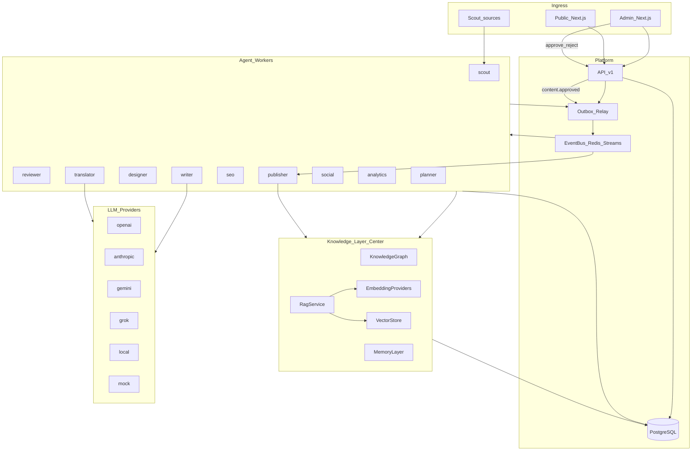

# SYSTEM_ARCHITECTURE.md

> Source of truth for AI BASE platform shape. Keep in sync with `packages/*`, `agents/*`, `apps/web`.

## Purpose

AI BASE is an **AI-operated company**: independent agent workers continuously discover, evaluate, write, and publish AI-tool content. Humans approve every publish. The public website consumes published state only.

**Knowledge Layer is central**: Graph + Memory + RAG are shared by all agents (`ctx.knowledge`). See [KNOWLEDGE_LAYER.md](./KNOWLEDGE_LAYER.md).

## High-level diagram

## Locked stack

| Layer | Implementation |
|-------|----------------|
| Monorepo | pnpm workspaces + Turborepo |
| App | Next.js App Router (`apps/web`) — public + admin |
| DB | PostgreSQL + Prisma (`packages/database`) |
| Events | CloudEvents + outbox + Redis Streams (`packages/events`) |
| Agents | Plugin workers (`agents/*` + `packages/agents-sdk`) |
| Knowledge | Graph + Memory + RAG (`packages/knowledge`) |
| Embeddings | Provider registry (`packages/embeddings`) |
| Vectors | VectorStore port (`packages/vector`) |
| LLM | Provider registry (`packages/llm`) — vendor-agnostic |
| Auth | RBAC (`packages/auth`) — Supabase-ready, local admin bypass |
| i18n | `en` / `ja` first-class (`packages/i18n`) |

## Isolation rules

1. Agents never import each other.
2. Agents depend only on `@ai-base/agents-sdk` (+ transitive packages). Use `ctx.llm` and `ctx.knowledge`.
3. No direct agent-to-agent HTTP/RPC — events only.
4. Publisher is the only writer that sets public `ai_tools.status = published`, and only after `content.approved.v1`.
5. Knowledge writes go through Knowledge Layer services — not ad-hoc SQL in plugins.

## Reliability

- Transactional outbox for durable emit
- At-least-once delivery via Redis Streams consumer groups
- Idempotent handlers via `event_consumptions`
- `EventBus` / `EmbeddingProvider` / `VectorStore` / `LlmProvider` ports for backend swaps

## Related docs

- [KNOWLEDGE_LAYER.md](./KNOWLEDGE_LAYER.md)
- [AGENT_ARCHITECTURE.md](./AGENT_ARCHITECTURE.md)
- [EVENT_SYSTEM.md](./EVENT_SYSTEM.md)
- [DATABASE_SCHEMA.md](./DATABASE_SCHEMA.md)
- [DEPLOYMENT.md](./DEPLOYMENT.md)
